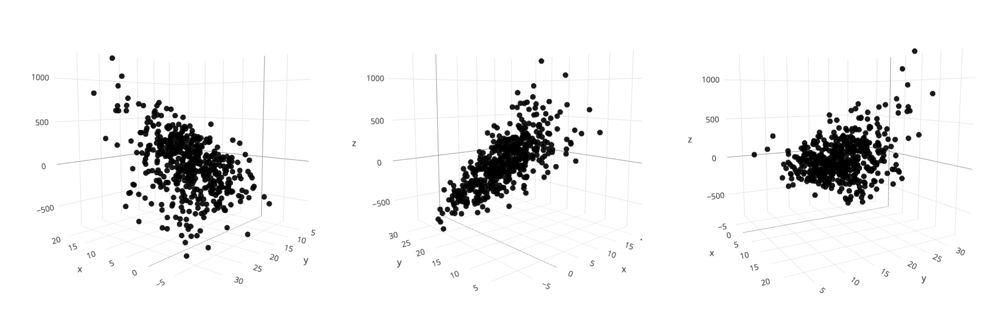
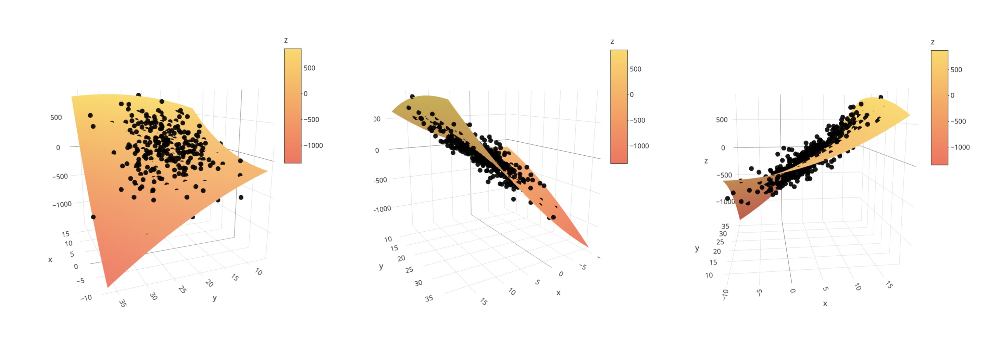

```{r, include = FALSE}
knitr::opts_chunk$set(
  collapse = TRUE,
  comment = "#>",
  fig.path = "man/figures/README-",
  out.width = "75%",
  fig.align = "center"
)
library(simply3d)
```

# {simply3d}: Convenient and fast creation of dynamic 3D Plots

This package is motivated by the fact that the plotly R package enables the creation of really awesome 3D Plots that can be dynamically viewed from all angles. This makes 3D-visualization finally useful. Sadly however the plotly syntax is not very intuitive which makes it tedious to create these plots. The functions in this package are inspired in their syntax by the base R functions `plot()` and `curve()` to make it really simple and fast to create such 3D plots.

At the moment it includes the functions `simply_scatter()` which allows the easy creation of 3D scatterplots and `surface()` as the 3D analogue to `curve()`. You can also combine these two by adding a surface to a scatter plot, for example when plotting a fitted regression model. For more details please see the documentation.

## Installation

```{r, eval = FALSE}
devtools::install_github("janoleko/simply3d")
```

## Example

```{r, eval=F, message=F, warning = F}
library(simply3d)
library(tidyverse)

# generating data
x1 = rnorm(500, 5, 5)
x2 = rnorm(500, 20, 5)
y = 8 - 0.4*x1 + 0.4*x2 + 1*x1^2 - 0.6*x2^2 + 2*x1*x2 + rnorm(500, 0, 100)
```

#### Creating a scatter plot

```{r, eval = F, message=F, warning = F}
scatter = simply_scatter(x1, x2, y)
scatter
```



#### Fitting a linear regression model

```{r, eval = F, message=F, warning = F}
mod = lm(y~x1+x2+I(x1^2)+I(x2^2)+I(x1*x2))
```

#### Adding the regression function to the existing scatterplot

```{r, eval = F, message=F, warning = F}
scatter %>% surface(expr = predict(mod, data.frame(x1 = x, x2 = y)),
                    x = x1, y = x2)
```




